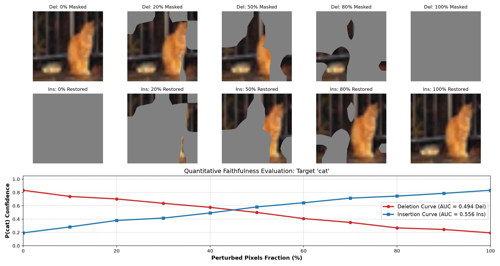
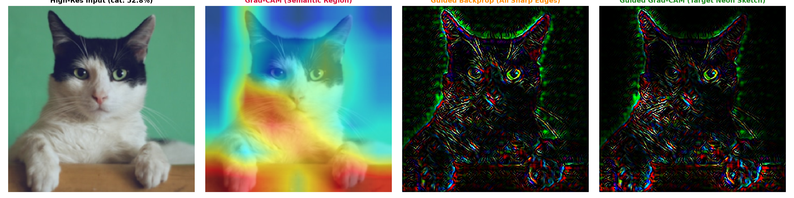
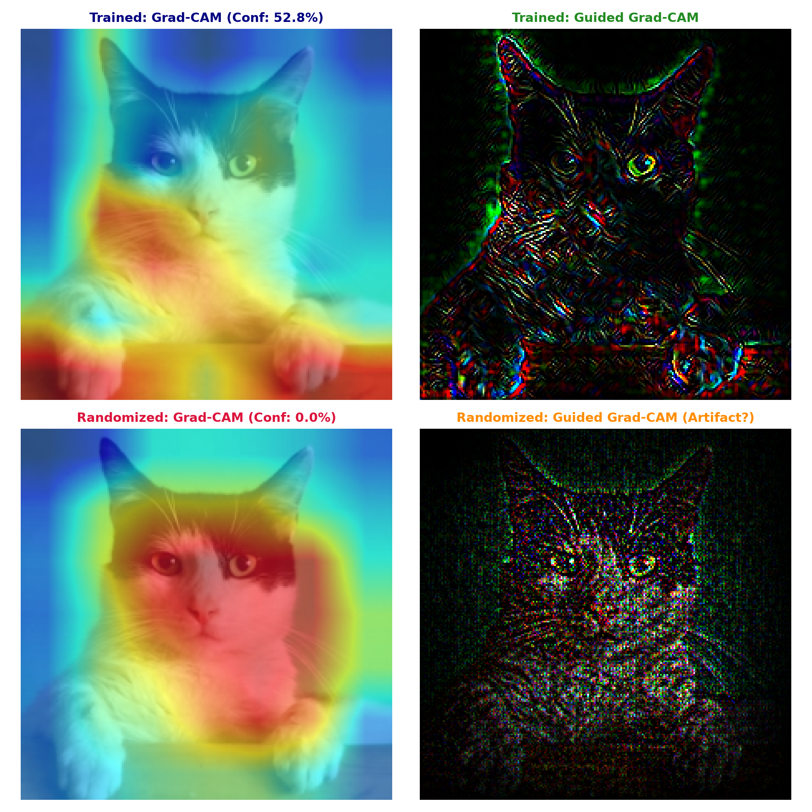

# ? CIFAR-10 Vision Pipeline & Advanced XAI Verification Study

PyTorch 기반 컴퓨터 비전 모델(ResNet18)의 전이학습 최적화(Ablation Study)부터 설명 가능한 인공지능(XAI)의 정량적·정성적 신뢰성 검증(Faithfulness & Sanity Check)까지 전 과정을 탐구한 엔지니어링 연구 저장소입니다.

---

## ? 주요 연구 및 구현 내용

- **Transfer Learning & Optimization:** ImageNet 사전학습 ResNet18 백본을 CIFAR-10에 맞춰 재설계하고, `CosineAnnealingLR` 및 `ColorJitter` 증강을 적용해 검증 정확도 **86.40%** 달성.
- **XAI Quantitative Faithfulness:** Petsiuk et al.(BMVC 2018) 방법론에 기반한 **Insertion & Deletion Score** 메트릭 파이프라인을 구축하여 픽셀 섭동(Perturbation)에 따른 모델 확신도 곡선(AUC) 산출.
- **High-Resolution Guided Grad-CAM:** 거친 의미론적 활성화 지도(Grad-CAM)와 입력단 역전파 윤곽선(Guided Backpropagation)을 결합하여 고주파 엣지 스케치 추출.
- **Axiomatic Sanity Check (NeurIPS 2018):** 가중치 난수화(Randomization Test)를 통해 시각화 기법이 모델의 실제 파라미터에 의존하는지, 아니면 단순 입력 이미지 엣지 검출기(Artifact)에 불과한지 실증.

---

## ? 종합 실험 결과 요약 (Experiment Log)

| 실험 구분 | 모델 / 기법 | 세부 설정 | 주요 성능 및 평가 지표 | 핵심 관찰 결과 |
| :--- | :--- | :--- | :--- | :--- |
| **Baseline** | ResNet18 | 3 Epochs, AdamW ($10^{-3}$) | Accuracy: **77.86%** | 베이스라인 파이프라인 구축 |
| **Extended** | ResNet18 | 10 Epochs, AdamW ($10^{-3}$) | Accuracy: **82.50%**, Loss: 0.51 | 오답 분석을 통한 배경 편향(Context Bias) 확인 |
| **Ablation Study** | ResNet18 | CosineAnnealing + ColorJitter | Accuracy: **86.40%** (+3.9%p) | 손실값 진동 제어 및 지름길 학습 완화 |
| **XAI Faithfulness** | Grad-CAM | Step-wise 10% Neutral Perturbation | Del AUC: **0.494** / Ins AUC: **0.556** | 7x7 특징 맵 보간 한계로 인한 선형 감쇄 관찰 |
| **Sanity Check** | Grad-CAM vs Guided Grad-CAM | Kaiming Normal Weight Randomization | Confidence: **52.8% → 0.0%** | Grad-CAM은 검증 통과, Guided 계열의 엣지 필터 착시 적발 |

---

## ? XAI 정량·정성 심화 분석 (Deep Dive)

### 1. Insertion & Deletion Score: 설명 충실도(Faithfulness) 정량화
Grad-CAM이 지목한 중요 픽셀의 실제 기여도를 검증하기 위해, 중요도 순위에 따라 픽셀을 단계별로 차폐(Deletion) 및 복원(Insertion)하며 예측 확률의 궤적을 측정했습니다.



- **기저 이미지(Baseline) 설정의 중요성:** 초기 가우시안 블러 기저 사용 시 고양이의 색상·실루엣 정보 누수(Leakage)로 확률 감쇄가 일어나지 않는 현상을 발견하여, 정보량이 0인 중립 단색(Neutral Gray, 0.5) 캔버스로 교체하여 정보 누수를 원천 차단함.
- **선형 감쇄와 해상도 한계:** Deletion AUC 0.494, Insertion AUC 0.556으로 도출됨. 이상적인 계단식 급락 곡선 대신 대각선 선형 감쇄가 나타난 원인은 ResNet18 Layer 4의 $7 \times 7$ 특징 맵을 $224 \times 224$로 보간(Bilinear Interpolation)하는 과정에서 픽셀 우선순위 분별력이 완화되었기 때문임을 규명함.

---

### 2. High-Resolution Guided Grad-CAM 시각화
저해상도($32 \times 32$) 데이터에서 발생하는 그래디언트 뭉개짐을 극복하고 고주파(High-frequency) 세부 정보를 확인하기 위해 고해상도 입력 파이프라인을 구축했습니다.



- **Grad-CAM (Semantic Region):** 의사결정 위치(Where)를 나타내는 거시적 영역 포착.
- **Guided Backpropagation:** 입력단까지 양의 그래디언트만 역전파하여 고해상도 엣지 추출.
- **Guided Grad-CAM:** 원소별 곱셈($\odot$)을 통해 배경 노이즈를 제거하고 타깃 사물의 국소 윤곽선(동공, 귓바퀴, 수염)을 선명한 네온 스케치로 추출.

---

### 3. Model Parameter Randomization Sanity Check (NeurIPS 2018)
시각적 그럴듯함(Plausibility)이 실제 모델의 추론 근거(Faithfulness)와 일치하는지 확인하기 위해 모델의 모든 합성곱 및 완전연결 계층 가중치를 Kaiming Normal 난수로 초기화하는 파괴 검증을 수행했습니다.



- **Grad-CAM (Sanity Check 통과):**
  - 가중치가 파괴되자 타깃 확신도가 **52.8%에서 0.0%로 추락**함.
  - 사물 중심에 맺히던 활성화 초점이 상실되고 멍한 배경 블러로 흩어지며 모델 파라미터 의존성을 입증함.
- **Guided Grad-CAM (시각적 착시 적발):**
  - 모델의 지능이 완전히 소멸(0.0%)되었음에도 불구하고, **고양이의 귓바퀴, 눈, 수염, 발가락 윤곽선이 난수화 모델에서도 그대로 스케치**되는 현상 확인.
  - **학술적 결론:** Guided Backprop 계열은 신경망이 학습한 지능을 시각화하는 것이 아니라, 수식 특성상 원본 사진의 고주파 경계선을 긁어오는 단순 엣지 추출 필터(Sobel Filter 유사)처럼 동작한다는 점을 실증함.

---

## ? 실행 방법

```bash
# 1. 의존성 패키지 설치
pip install -r requirements.txt

# 2. 모델 최적화 학습 (Ablation Study)
python3 train_advanced.py

# 3. XAI Faithfulness (Insertion & Deletion Score) 벤치마크
python3 faithfulness_eval.py

# 4. 고해상도 Guided Grad-CAM 시각화
python3 guided_cam_hires.py

# 5. 가중치 난수화 건전성 검증 (Sanity Check)
python3 sanity_check_hires.py