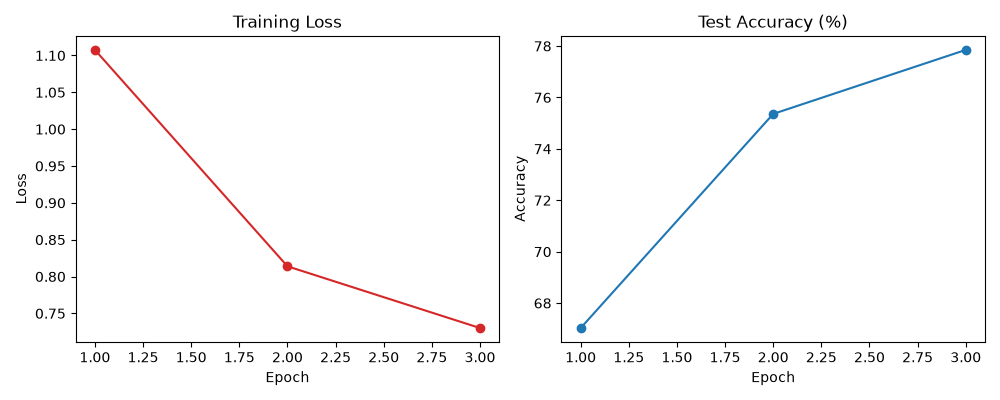

# ? CIFAR-10 Image Classification with ResNet18 (Transfer Learning)

PyTorch 기반 비전 전이학습(Transfer Learning) 파이프라인

## ? 주요 구현 내용
- **Model:** ImageNet 사전학습 ResNet18 백본 활용 및 CIFAR-10(10 Classes) 맞춤 FC Layer 재설계
- **Data Augmentation:** RandomCrop(padding=4), RandomHorizontalFlip, Normalization 적용
- **Optimization:** AdamW Optimizer ($lr=10^{-3}$, $weight\_decay=10^{-4}$) 및 CrossEntropyLoss 적용
- **Evaluation:** 매 에폭마다 검증 데이터셋에 대한 Accuracy 추적 및 시각화

## ? 학습 결과 (3 Epochs)
- **최종 검증 정확도 (Test Accuracy):** **77.86%**
- **Loss 수렴:** 1.10 $\rightarrow$ 0.73으로 안정적 수렴 확인

## ? 실행 방법
\`\`\`bash
# 1. 의존성 패키지 설치
pip install -r requirements.txt

# 2. 학습 및 평가 파이프라인 실행
python main.py
\`\`\`