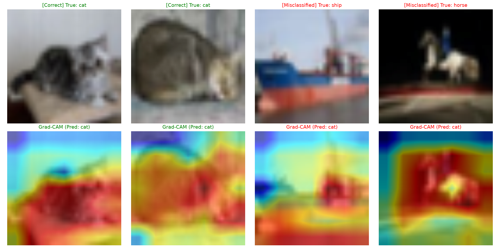

# ? CIFAR-10 Image Classification with ResNet18 (Transfer Learning & XAI)

PyTorch 기반 비전 전이학습(Transfer Learning) 및 설명 가능한 AI(Grad-CAM) 분석 파이프라인입니다.

## ? 주요 구현 내용
- **Model:** ImageNet 사전학습 ResNet18 백본 활용 및 CIFAR-10(10 Classes) 맞춤 FC Layer 재설계
- **Data Augmentation & Input Pipeline:** RandomCrop(padding=4), RandomHorizontalFlip, Normalization 및 공간 해상도 확보를 위한 224×224 업샘플링 파이프라인 구축
- **Optimization & Checkpointing:** AdamW Optimizer ($lr=10^{-3}$, $weight\_decay=10^{-4}$), CrossEntropyLoss 적용 및 최고 성능 가중치 자동 저장(`best_model.pth`)
- **Evaluation & Analysis:** 에폭별 성능 추적, 실패 사례(오답) 정성 분석 및 Grad-CAM 기반 의사결정 근거 히트맵 시각화

---

## ? 단계별 실험 결과 (Experiment Log)

| 실험 단계 | 반복 횟수 (Epochs) | 최종 Training Loss | 최종 검증 정확도 (Accuracy) | 비고 |
| :--- | :---: | :---: | :---: | :--- |
| **Day 1 (Baseline)** | 3 | 0.73 | **77.86%** | 베이스라인 파이프라인 구축 |
| **Day 2 (Extended)** | 10 | 0.51 | **82.50%** | 파라미터 수렴 및 오답 분석 수행 |
| **Day 3 (XAI Integration)** | - | - | - | `best_model.pth` 연동 및 Grad-CAM 의사결정 시각화 구축 |


---

## ? Error Analysis (오답 원인 정성 분석)
테스트 데이터셋 중 모델이 잘못 분류(Misclassified)한 대표 샘플 5종을 추출하여 시각화하고 실패 원인을 분석했습니다.


- **배경 편향 (Context Bias):** 배(ship) 및 비행기(airplane)가 사슴(deer)으로 오분류된 사례를 통해, 모델이 객체 자체의 형태뿐만 아니라 회색빛/저채도 배경 색감에 의존하는 경향 확인.
- **형태적 유사성 (Shape Confusion):** 걸윙 도어가 열린 자동차(automobile)의 윤곽선이 동물의 뾰족한 귀 실루엣과 유사하여 고양이(cat)로 오분류됨.
- **향후 과제:** 설명 가능한 AI(XAI, Grad-CAM)를 도입하여 의사결정 영역을 정밀 규명할 예정.

---

## ? Explainable AI: Grad-CAM 의사결정 근거 시각화
ResNet18 모델의 최종 합성곱 층(`layer4[-1]`)을 추적하여 의사결정 근거를 시각화했습니다.



### ? 정성 분석 결과 (Qualitative Analysis)
1. **정상 분류 사례 (Correct Case - Green):**
   - **고양이 (Cat $\rightarrow$ Cat):** 배경(소파, 바닥)에 현혹되지 않고, 고양이의 고유 형태인 **몸통 중심부의 털 질감 및 웅크린 등 윤곽선**에 선명한 붉은색 활성화(High Activation)가 집중됨을 확인.
2. **오분류 원인 규명 (Misclassified Case - Red):**
   - **배 (True: ship $\rightarrow$ Pred: cat):** 바다와 하늘 배경은 배제했으나, **배의 붉은 선체 하부와 뾰족하게 솟은 뱃머리 구조물**에 강한 붉은 불이 집중됨. 뾰족한 각도의 실루엣을 동물의 '귀' 특징으로 오인한 형태적 착각(Shape Confusion) 메커니즘을 시각적으로 규명.
   - **말 (True: horse $\rightarrow$ Pred: cat):** 어두운 배경을 걷어내고 **바닥을 딛고 있는 흰색 말의 몸통 덩어리**에 집중 활성화가 발생함. 네 발 달린 동물의 중심 체형 실루엣을 고양이의 형태와 분별하지 못한 오류 패턴 입증.

### ? 텐서 차원(Tensor Dimension) 및 아키텍처 관점의 고찰
- **왜 `model.layer4[-1]`을 타겟팅했는가?**
  - 신경망의 초반 계층은 점·선 등 저수준 특징만 추출하지만, 최상단 계층(`layer4`)은 객체의 고차원 의미 개념(Semantic Concept)을 완성함.
  - 동시에 `AdaptiveAvgPool2d` 및 완전연결계층(`model.fc`)으로 넘어가 1차원 벡터($1 \times 1 \times 512$)로 찌그러지기 직전, **가로·세로 2차원 공간 좌표($7 \times 7$)가 살아있는 마지막 마지노선**이기 때문임.
- **224×224 리사이즈의 필요성 규명:**
  - $32 \times 32$ 해상도를 직접 통과시킬 경우 최종 특징 맵이 $1 \times 1$ 수준으로 압축되어 히트맵이 파랗게 뭉개지는 한계 확인.
  - 입력을 $224 \times 224$로 업샘플링하여 합성곱 층의 공간 해상도를 확보함으로써 선명한 국소 집중 히트맵(High-contrast Heatmap) 도출 성공.

---

## ? 실행 방법
```bash
# 1. 의존성 패키지 설치
pip install -r requirements.txt

# 2. 학습 및 최고 모델 저장 파이프라인 실행
python3 main.py

# 3. 오답 분석 실행 및 시각화
python3 error_analysis.py

# 4. 선명한 4구리드 Grad-CAM 시각화 실행
python3 cam_grid.py

# 5. 단일 샘플 Grad-CAM 추론
python3 cam_test.py