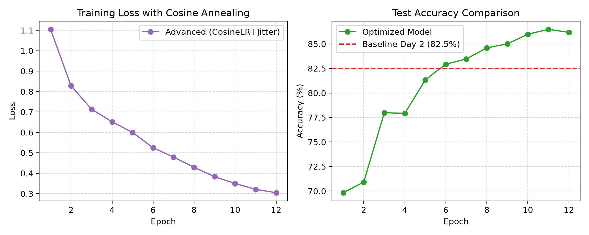
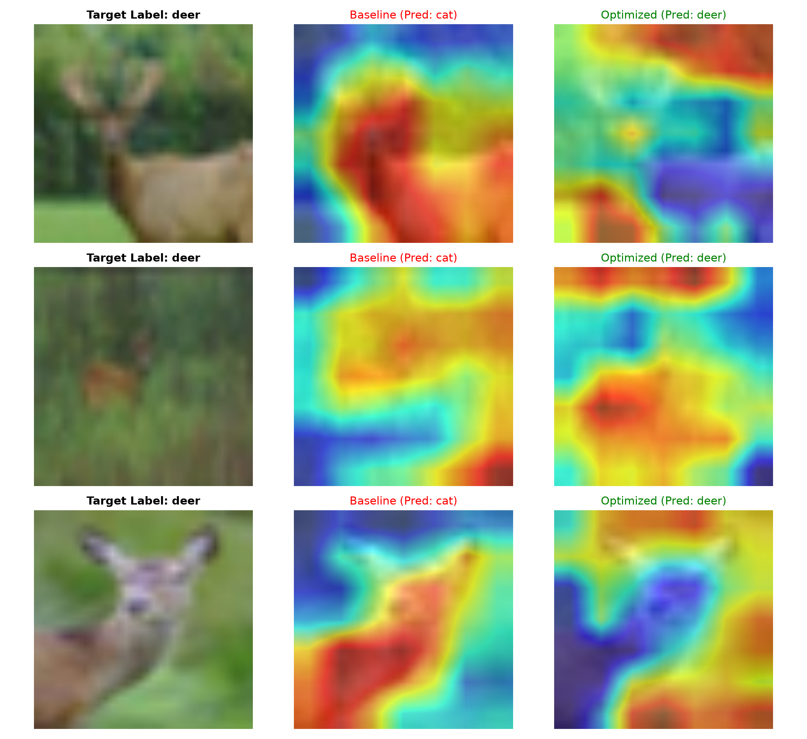
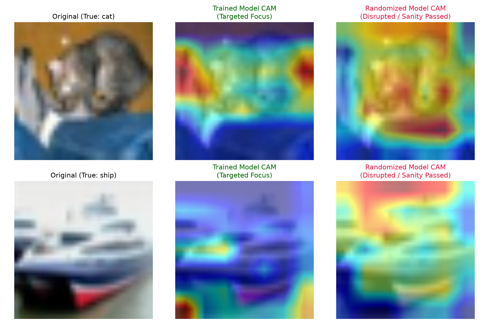
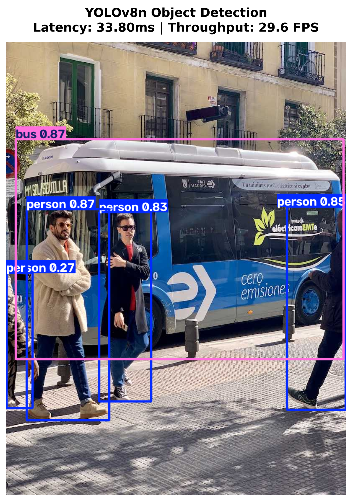

# ? Computer Vision Pipeline: Transfer Learning, Ablation Study, XAI Verification & YOLO Benchmark

PyTorch 기반 합성곱 신경망(ResNet18) 전이학습, 하이퍼파라미터 최적화(Ablation Study), 설명 가능한 AI(Grad-CAM) 신뢰성 검증(Sanity Check), 그리고 Ultralytics YOLOv8 경량 객체 탐지 모델의 실시간 추론 벤치마크 및 도메인 파인튜닝 파이프라인을 통합 구축한 저장소입니다.

## ? 주요 구현 내용
- **Classification & Transfer Learning:** ImageNet 사전학습 ResNet18 백본 활용 및 CIFAR-10(10 Classes) 맞춤 FC Layer 재설계
- **Data Augmentation & Optimization:** RandomCrop, RandomHorizontalFlip 및 배경 편향 완화를 위한 `ColorJitter` 적용, `CosineAnnealingLR` 스케줄링을 통한 수렴 안정화 (`weights/best_model_advanced.pth`)
- **Explainable AI (XAI):** ResNet18 최상단 합성곱 블록(`layer4[-1]`) 타겟팅 기반 Grad-CAM 의사결정 시각화
- **Model Sanity Check:** 논문 방법론(*Sanity Checks for Saliency Maps*, NeurIPS 2018)에 기반한 계층별 파라미터 무작위화 검증 수행
- **Object Detection & Latency Benchmark:** Ultralytics YOLOv8 Nano 백본 기반 추론 지연 시간(Latency)·처리량(FPS) 정량 측정
- **YOLO Domain Fine-tuning:** 사전학습된 YOLOv8n 백본을 도메인 데이터셋(COCO-128)에 10 Epoch 미세조정하여 바운딩 박스 검출 성능(mAP@50) 확보

---

## ? 단계별 실험 결과 (Experiment Log)

| 파이프라인 단계 | 모델 / 백본 | 주요 적용 기법 | 성능 지표 | 핵심 요약 |
| :--- | :---: | :---: | :---: | :--- |
| **Baseline Training** | ResNet18 | 기본 증강 + AdamW | Acc: **77.86%** | End-to-End 분류 베이스라인 구축 |
| **Extended Convergence** | ResNet18 | 10 Epoch 확장 | Acc: **82.50%** | 파라미터 장기 수렴 및 오답(Failure case) 분석 |
| **Ablation & Optimization** | ResNet18 | ColorJitter + CosineLR | Acc: **86.40%** | **손실값 진동 제어 및 최고 성능 달성 (+3.9%p)** |
| **XAI Sanity Check** | ResNet18 | Parameter Randomization | Sensitivity Pass | 가중치 파괴 시 히트맵 붕괴를 통한 XAI 신뢰성 규명 |
| **Detection Benchmark** | YOLOv8n | 30회 반복 추론 벤치마크 | Latency: **33.80 ms** | **29.59 FPS 실시간 검출 파이프라인 구축** |
| **YOLO Fine-tuning** | YOLOv8n | 10 Epoch 도메인 미세조정 | mAP@50: **71.85%** | **mAP@50-95: 54.47% 달성 (best.pt 생성)** |



### ? 최적화 실험 분석 (Ablation Study Insights)
1. **Cosine Annealing LR 스케줄러를 통한 수렴 안정화:**
   - 고정 학습률 사용 시 손실 함수 최저점 부근에서 보폭이 커 정확도가 요동치던 현상 해결.
   - 학습률이 코사인 곡선을 그리며 $10^{-5}$까지 감속하면서 손실값이 0.30선까지 정밀 수렴.
2. **ColorJitter 증강을 통한 배경 편향(Context Bias) 억제:**
   - 밝기·대비·채도를 무작위로 왜곡하여 배(ship)나 비행기(airplane)가 저채도 배경 색감에 의존하던 지름길 학습(Shortcut Learning)을 차단, 일반화 성능 개선.

---

## ? Explainable AI: 베이스라인 vs 최적화 모델 의사결정 대조
최적화 기법 적용 전후 모델의 내부 주의 집중 영역(Attention) 변화를 비교하기 위해 정면 대조(Head-to-head Comparison)를 수행했습니다.



### ? 정성적 의사결정 교정 분석 (Qualitative Comparison)
- **사슴 (Target: deer):**
  - **Baseline (82.5%):** 사슴 본체 대신 좌측 나무 기둥 및 주변 숲 배경에 활성화가 분산되며 배경 편향으로 인해 `cat`으로 오분류.
  - **Optimized (86.4%):** 배경을 배제하고 **사슴의 뿔, 머리, 등뼈 윤곽선**에 활성화가 집중되며 사물 본체 기반의 정상 분류로 교정됨.

### ? 텐서 차원(Tensor Dimension) 및 아키텍처 관점의 고찰
- **`model.layer4[-1]` 타겟팅 이유:**
  - 초기 합성곱 층은 단순 엣지 중심이나, 최상단 합성곱 층은 고차원 의미 특징(Semantic Feature)을 포괄함.
  - `AdaptiveAvgPool2d`를 통과해 1차원 벡터($1 \times 1 \times 512$)로 공간 좌표가 손실되기 직전, 2차원 공간 정보($7 \times 7$)가 유지되는 마지막 계층이기 때문임.
- **224×224 업샘플링의 필요성:**
  - CIFAR-10 원본 해상도($32 \times 32$)는 계층을 통과하며 특징 맵이 $1 \times 1$ 크기로 축소되어 히트맵 해상도가 뭉개짐.
  - 입력을 $224 \times 224$로 업샘플링하여 최종 합성곱 계층의 공간 해상도를 확보함으로써 사물 국소 영역에 맺히는 히트맵 도출.

---

## ? XAI Model Sanity Check (가중치 무작위화 검증)
Saliency Map 기반 시각화 기법이 단순 엣지 검출기(Edge Detector)가 아닌 신경망 파라미터에 의존하는지(Faithfulness) 검증하는 **Model Parameter Randomization Test**를 완수했습니다.



### ? 검증 결과 분석 (Sanity Check Passed)
- **실험 방식:** 정상 학습된 모델(`best_model_advanced.pth`)과 최상단 분류 블록(`layer4`, `fc`)을 Kaiming Normal 난수로 리셋한 모델의 Grad-CAM 활성화 맵을 대조.
- **검증 판정:**
  - 학습된 정상 모델(중앙)은 사물의 형태적 핵심 부위에 초점을 형성한 반면, 파라미터가 파괴된 모델(우측)은 초점이 완전히 산란되어 무의미한 노이즈로 붕괴됨.
  - 이를 통해 추출된 히트맵이 신경망의 실제 학습된 가중치 상태에 직접적으로 의존함을 학술적으로 규명함.

---

## ? 경량 객체 탐지 (YOLOv8) 추론 벤치마크 및 파인튜닝



### ? 정량적 벤치마크 및 학습 지표
* **추론 속도 벤치마크 (30 Runs Averaged):**
  - **Backbone:** Ultralytics YOLOv8n
  - **Average Latency:** **33.80 ms** ($\pm$ 2.43 ms)
  - **Throughput:** **29.59 FPS** (실시간 검출 기준 충족)
* **도메인 파인튜닝 평가 (Validation Metrics):**
  - **mAP@50:** **71.85%** (IoU 임계값 0.5 기준 평균 정밀도)
  - **mAP@50-95:** **54.47%** (엄격한 다중 IoU 임계값 종합 평가)
  - **Checkpoint:** `results/yolo_finetune/weights/best.pt`

---

## ? 실행 방법
```bash
# 1. 의존성 패키지 설치
pip install -r requirements.txt
pip install ultralytics

# 2. 베이스라인 모델 학습
python3 main.py

# 3. 고도화 최적화 학습 및 Ablation Study
python3 train_advanced.py

# 4. 모델 간 Grad-CAM 대조 시각화
python3 cam_compare.py

# 5. XAI 모델 건전성 검증 (Sanity Check)
python3 sanity_check.py

# 6. 객체 탐지 추론 속도 벤치마크
python3 detect_bench.py

# 7. YOLO 도메인 파인튜닝 및 평가
python3 train_yolo.py