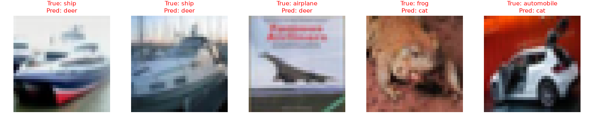

# ? CIFAR-10 Image Classification with ResNet18 (Transfer Learning)

PyTorch 기반 비전 전이학습(Transfer Learning) 파이프라인

## ? 실험 결과 (10 Epochs 확장 실험)
- **최종 검증 정확도 (Test Accuracy):** **82.5%** (기존 3 에폭 77.8% 대비 약 4.7%p 상승)
- **최종 Training Loss:** 0.51 달성
- **분석 관찰:** 에폭 증가에 따라 손실값은 0.51까지 안정적으로 수렴했으나, 검증 정확도에서 77%~82% 구간의 진동이 관찰됨. 향후 Learning Rate Scheduler나 Weight Decay 조정을 통한 안정화 실험 필요성 확인.

## ? Error Analysis (오답 원인 정성 분석)
테스트 데이터셋 중 오분류(Misclassified)된 대표 샘플 5종을 추출하여 모델의 실패 요인을 분석했습니다.

- **배경 편향 (Context Bias):** 배(ship) 및 비행기(airplane)가 사슴(deer)으로 오분류된 사례를 통해, 모델이 객체 자체의 형태뿐만 아니라 회색빛/저채도 배경 색감에 영향을 받음을 확인.
- **형태적 유사성 (Shape Confusion):** 걸윙 도어가 열린 자동차(automobile)의 윤곽선이 동물의 뾰족한 귀 실루엣과 유사하여 고양이(cat)로 오분류됨.
- **향후 과제:** 색상 지터링(Color Jitter) 증강 기법 및 객체 집중도를 높이는 어텐션/XAI(Grad-CAM) 분석 필요성 도출.